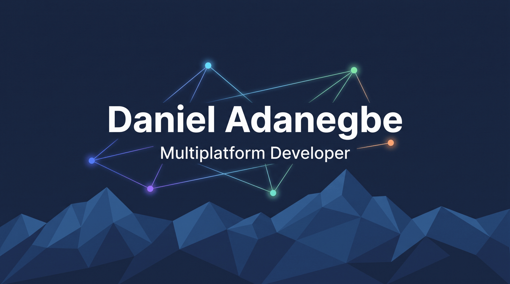

Multiplatform developer, CFGS DAM graduate, looking for a junior developer role. I work across
web, desktop, Android, backend and embedded, and I'd rather ship something small that runs than
leave something big half-finished.

- Built a club-management ERP with two classmates during my DAM work placement — CRUD, roles,
  bulk email — on a Java and Spring Boot stack.
- The projects below are coursework and personal work, cleaned up and made to run from a clean
  clone with no external service behind them: a local database, a stubbed mail sender, a local
  MQTT broker.
- On CI/CD: [incident-tracker](https://incident-tracker-6sbn.onrender.com) runs its test suite
  and publishes a coverage badge on every push and is deployed on Render, web-calculator
  deploys itself to GitHub Pages, and every ESP32 exercise in [embedded-systems-lab](https://github.com/PresidenteOG/embedded-systems-lab/actions/workflows/wokwi-ci.yml)
  runs headless in the simulator.
- Terrassa, Catalonia. Spanish and Catalan native, English B2.
- danieladanegbe@gmail.com

#### Stack

#### How I use AI in my workflow

I treat AI as part of the toolchain, not a black box — I review and test what it produces before it ships.

- **Claude / Claude Code** — architecture decisions, implementation, debugging, and the agent/skill tooling behind this workflow.
- **Gemini** — image generation for banners and diagrams, and a free second-opinion model for research and drafts.
- **Qwen** — a secondary model for cross-checking outputs on specific tasks.
- **LM Studio** — local, offline model for bulk mechanical work (batch text drafts, redaction passes) that doesn't need real reasoning.
- **Antigravity** — routes research/drafting tasks to free Gemini/Claude quota instead of burning paid usage.

#### Projects

| Project | Stack | What it is |
|---|---|---|
| [tennis-club-manager](https://github.com/PresidenteOG/tennis-club-manager) |    | Back office for a tennis club — members, leagues, courts, matches, announcements. Team project from the DAM course. |
| [restaurant-erp](https://github.com/PresidenteOG/restaurant-erp) · [live](https://restaurant-erp-9nwf.onrender.com) |     | Back-office ERP for a restaurant — menu, tables, orders, kitchen, cash reconciliation, staff chat with a Telegram bridge. |
| [gaula-student-manager](https://github.com/PresidenteOG/gaula-student-manager) |     | Full-stack school-management platform — REST API with JWT auth and role-based access, Flutter client for Android and web. |
| [biblionet-library-app](https://github.com/PresidenteOG/biblionet-library-app) |    | Android app for a network of small libraries — shared catalogue, branch stock, loans, a reading quiz. |
| [q-learning-piano-tiles](https://github.com/PresidenteOG/q-learning-piano-tiles) |   | A Q-learning agent that teaches itself to play a Piano-Tiles reflex game, with the state/reward table rendered live. |
| [incident-tracker](https://github.com/PresidenteOG/incident-tracker) · [live](https://incident-tracker-6sbn.onrender.com) |    | Internal IT incident log — controller → service → JPA repository, session login, in-memory H2. Service layer under test, coverage badge, CI on every push, deployed on Render. |
| [fiber-device-manager](https://github.com/PresidenteOG/fiber-device-manager) |   | Android console for a device fleet. Runs entirely on-device — no backend, no `INTERNET` permission. |
| [room-planner-3d](https://github.com/PresidenteOG/room-planner-3d) |    | Desktop room designer — 2D plan, 3D preview, undo/redo, its own `.roomz` save format. |
| [encrypted-mqtt-chat](https://github.com/PresidenteOG/encrypted-mqtt-chat) |   | Group chat where the broker only sees ciphertext. Honest about what the shared-key model does and doesn't protect. |
| [unity-minigames](https://github.com/PresidenteOG/unity-minigames) |   | Two workshop minigames — a physics ball-roller with NavMesh enemy AI and a platform/portal runner. Playable Windows and Linux builds attached. |
| [embedded-systems-lab](https://github.com/PresidenteOG/embedded-systems-lab) |   | Sensor, actuator and MQTT exercises in the Wokwi simulator. Every one runs headless in CI. |
| [web-calculator](https://github.com/PresidenteOG/web-calculator) · [live](https://presidenteog.github.io/web-calculator/) |    | One HTML file, no build step, no dependencies. Deployed to GitHub Pages by Actions. |
| [learning-lab](https://github.com/PresidenteOG/learning-lab) | Java · Python · JS · CSS · Bash | Two years of small coursework exercises, sorted by language, with a note on what each one practices. |
| [claude-skills](https://github.com/PresidenteOG/claude-skills) | — | 39 general-purpose Claude Code skills I use day-to-day, published for reuse. |
| [claudefx-template](https://github.com/PresidenteOG/claudefx-template) | — | Sanitized starter structure for an Obsidian-vault-as-Claude-Code-workspace. |

#### Work placement

Second-year DAM placement at Club de Tennis Terrassa: a club-management ERP in Java, Spring
Boot, Docker and MySQL. CRUD for members and bookings, role-based access, bulk and
category-targeted email. It's a three-person codebase, so what's on GitHub
([tennis-club-manager](https://github.com/PresidenteOG/tennis-club-manager)) is a clean copy
with the real club's data stripped out — I can walk through the original in an interview.

Before that, a first-year SMIX placement at Escola La Nova Electra doing hardware diagnosis and
IT support.
